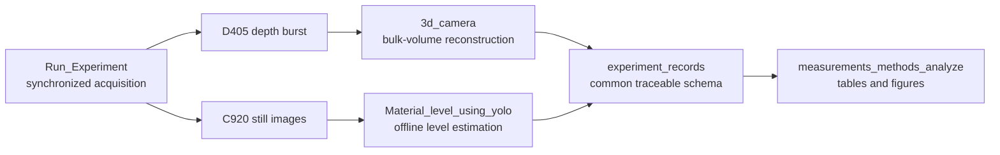

# Non-Contact Dry-Material Monitoring for Self-Driving Laboratories

**RGB/YOLO level estimation • RGB-D bulk-volume reconstruction • synchronized
multimodal acquisition • method comparison**

<table>
  <tr>
    <td width="30%" align="center">
      
    </td>
    <td width="70%" align="center">
      
    </td>
  </tr>
  <tr>
    <td align="center"><sub><b>Laboratory setup</b><br>Automated dry-material dispensing station.</sub></td>
    <td align="center"><sub><b>RGB-D measurement view</b><br>D405-aligned view and circular region used for bulk-volume reconstruction.</sub></td>
  </tr>
</table>

Research software for measuring material level and visible bulk volume in a
polymer laboratory workflow. The repository integrates synchronized camera
acquisition, Intel RealSense D405 depth reconstruction, offline YOLO
segmentation, traceable records, and method-comparison analysis in one
installable project.

> **Research status:** beta research release (`v0.1.1`). Software tests verify
> implementation behavior; they do not establish accuracy, traceability, uncertainty, or
> metrological validation. Use the validation plan and report the frozen
> configuration, calibration, model hashes, hardware, and software release for
> every scientific result.

> **License:** repository software is released under the MIT License. Model
> weights, datasets, recordings, and third-party dependencies retain their own
> licenses and terms; see [`LICENSES.md`](LICENSES.md).

## System overview



YOLO inference is deliberately deferred until acquisition finishes. The depth
and YOLO results remain separate method tables with the same primary record
columns. The system does not automatically claim agreement, rank methods, or
convert software checks into scientific validation.

## Repository map

| Path | Role |
|---|---|
| `3d_camera/` | D405 capture, calibration, surface reconstruction, volume integration, setup tools, and validation documentation. |
| `Material_level_using_yolo/` | Material-specific saved-image YOLO workflow with semantic checks, evidence export, and GPU/CPU selection. |
| `Run_Experiment/` | Warming and software-coordinated acquisition from the D405 and C920 under one measurement identity. |
| `experiment_records/` | Shared schema, identifiers, validation, hashes, locks, and atomic XLSX/CSV export. |
| `measurements_methods_analyze/` | Traceable analysis and publication-quality plot generation from completed sessions. |
| `docs/material_level_study/` | Architecture, data dictionary, research checklist, and manual hardware checks. |
| `Tests/` | Root and legacy compatibility tests. |

The source folder names are intentionally preserved. Installation metadata,
citation, contribution policy, dependency declarations, CI, and ignore rules
are maintained only at the repository root.

## Quick start

Windows PowerShell and Python 3.11 are the supported acquisition environment:

```powershell
git clone https://github.com/AMDatIMDEA/dry-material-monitoring.git
cd dry-material-monitoring
py -3.11 -m venv .venv
.\.venv\Scripts\python.exe -m pip install --upgrade pip
.\.venv\Scripts\python.exe -m pip install -e ".[test]"
.\.venv\Scripts\python.exe -m pip check
.\.venv\Scripts\python.exe -m pytest -q
```

The most frequently used commands, including local-config variants, are kept
in the tracked [`fast_commands.txt`](fast_commands.txt). Detailed deployment
and reproduction instructions are in [`docs/DEPLOYMENT.md`](docs/DEPLOYMENT.md)
and [`REPRODUCING.md`](REPRODUCING.md).

For an exact Windows/Python 3.11 reproduction, install `pylock.toml` as shown in
`REPRODUCING.md`. Use the bounded editable-install command above when selecting
a workstation-specific CUDA build.

## Private configuration and non-Git assets

Tracked YAML files are portable examples. Laboratory-specific operational
values belong in files with `.local` inserted before the extension:

```text
3d_camera/config.local.yaml
Material_level_using_yolo/config.local.yaml
Run_Experiment/config.local.yaml
measurements_methods_analyze/config.local.yaml
```

These files are ignored by Git and retain laboratory paths, camera identity,
and local output locations. New laboratories should copy each tracked
`config.yaml` to `config.local.yaml`, then configure only the local copy.

Model weights, calibration arrays, recordings, research sessions, training
data, and generated outputs are also intentionally ignored. Their present
locations are preserved; organizing the tracked repository does not move or
delete them. For a paper, publish approved immutable assets in a data archive
with checksums and a DOI.

The portable model examples expect:

```text
Material_level_using_yolo/model_weights/powder_best.pt
Material_level_using_yolo/model_weights/polymer_best.pt
```

Numeric training class IDs are never trusted on their own. Before prediction,
the configured task and semantic class names are checked against the loaded
model metadata.

## GPU-first inference

The tracked YOLO configurations use `device: auto`. At runtime the software
asks PyTorch whether CUDA is usable, selects `cuda:0` when it is, and otherwise
uses CPU. A driver-discovery failure in auto mode also falls back to CPU. An
explicit `cpu` or `cuda:<index>` selection is not silently changed.

The YOLO `result.json` records both `requested_inference_device` and
`resolved_inference_device`. For strict paper reproduction, freeze a specific
device in the archived effective configuration. Install the correct PyTorch
build for the laboratory's CUDA driver using the official PyTorch selector;
the current local environment may otherwise remain CPU-only.

## Core workflows

### Hardware-free D405 check

```powershell
.\.venv\Scripts\python.exe .\3d_camera\run_measurement.py `
  --config .\3d_camera\config.yaml `
  --source synthetic --fill-percent 35 --no-export
```

### Synchronized acquisition

The study used two different tube geometries and their capacities must not be
interchanged: the Black PP tube is approximately `211.527 mL` (45 mm internal
diameter, 133 mm usable height), while the MCC and wood-powder tube is
approximately `197.041 mL` (56 mm internal diameter, 80 mm usable height). The
current tracked D405 example describes the powder tube. Use the exact frozen
capacity reported by the configuration used for a real experiment. Sanitized
paper parameter records are in [`paper_configs/`](paper_configs/).

```powershell
.\.venv\Scripts\python.exe .\Run_Experiment\run_experiment.py `
  --config .\Run_Experiment\config.local.yaml `
  --experiment-id mcc-sync-001 `
  --purpose "material-level validation" `
  --material-name MCC `
  --total-capacity-ml 197.040691233 `
  --total-possible-weight-g 107 `
  --operator-notes "mount and lighting frozen" `
  --output-root "D:\Research records\Material level study" `
  --yes
```

Wait for `ARMED`, then press `c` or left-click. Confirm the changing reference
weight, manual level, and notes for every measurement. Cancelling confirmation
allocates no measurement identity and captures nothing.

### Deferred YOLO processing

```powershell
.\.venv\Scripts\python.exe .\Material_level_using_yolo\process_synchronized.py `
  "D:\Research records\Material level study\mcc-sync-001" `
  --config .\Material_level_using_yolo\config.local.yaml `
  --profile powder --roi-mode whole_image
```

Completed groups are verified and skipped. Use `--force-reprocess` only when a
deliberate processing revision is required; the previous evidence is retained.
The paper profiles used explicit `whole_image` mode. This mode derives
provisional vertical normalization limits from dual-class semantic detections
and records that they are uncalibrated. A frozen `configured` ROI is an
alternative deployment mode for a fixed camera/tube setup: it supplies reviewed
full/empty axial limits and excludes background, but it must be calibrated and
validated independently and must not be described as the paper mode.

### Measurement analysis

```powershell
.\.venv\Scripts\analyze-measurements.exe `
  --config .\measurements_methods_analyze\config.local.yaml
```

## Evidence and session layout

```text
<output_root>/<experiment_id>/
  session_manifest.json
  effective_config.yaml
  depth_measurements.xlsx
  depth_measurements.csv
  yolo_measurements.xlsx
  yolo_measurements.csv
  provenance/
    environment.json
    depth_effective_config.yaml
    yolo_effective_config_<profile>.yaml
    calibration/...
  measurements/<measurement_id>/
    capture_manifest.json
    c920/raw/...
    depth/...
    yolo/...
    yolo_revisions/...
```

Writes are atomic where required by the record contract. Manifests and hashes
support interruption recovery and later audit. Do not manually replace primary
workbook sheets or delete source images before deferred inference.

## Scientific documentation

- [D405 algorithm](3d_camera/docs/ALGORITHM.md)
- [D405 validation plan](3d_camera/docs/VALIDATION.md)
- [YOLO method](Material_level_using_yolo/docs/METHOD.md)
- [YOLO model-card template](Material_level_using_yolo/MODEL_CARD.md)
- [Integrated architecture](docs/material_level_study/ARCHITECTURE.md)
- [Data dictionary](docs/material_level_study/DATA_DICTIONARY.md)
- [Research readiness checklist](docs/material_level_study/RESEARCH_CHECKLIST.md)
- [Manual camera smoke test](docs/material_level_study/MANUAL_SMOKE_TEST.md)

Depth reconstruction is sensitive to calibration, mount movement, transparent
or textureless surfaces, missing stereo depth, piles, cavities, and hidden
voids. YOLO estimates depend on frozen geometry/ROI, lighting, representative
training data, model semantics, segmentation quality, and independent
validation. The cameras are software-coordinated, not hardware-triggered.

## Authorship, citation, and release

The software author list and CRediT contribution statement are in
[`AUTHORS.md`](AUTHORS.md). Root citation metadata is in
[`CITATION.cff`](CITATION.cff). The canonical source repository is
[`AMDatIMDEA/dry-material-monitoring`](https://github.com/AMDatIMDEA/dry-material-monitoring).
The project owner's supplied [Zenodo deposition](https://zenodo.org/uploads/22697983)
is currently an upload/deposition link; replace it with the public record URL
and DOI after publication. Before the public release:

1. confirm author order and roles with all authors;
2. add institutional email addresses and ORCIDs;
3. create a versioned release and archive it, for example with Zenodo;
4. add the repository URL, software DOI, data DOI, and paper DOI to the
   citation metadata and README;
5. cite both the exact software release and the associated paper.

## Licensing

Repository software, including the `3d_camera/` component, is distributed under
the [MIT License](LICENSE). The `3d_camera/LICENSE` file preserves the same MIT
terms and names Mostafa Abd Al Kader and IMDEA Materials Institute as copyright
holders. Review the Ultralytics/model licensing terms and all third-party assets
before a public or commercial release. See [`LICENSES.md`](LICENSES.md) for the
remaining scope boundaries.

## Contributing

See [`CONTRIBUTING.md`](CONTRIBUTING.md) for scientific-change requirements and
privacy rules. Notable changes belong in [`CHANGELOG.md`](CHANGELOG.md).
